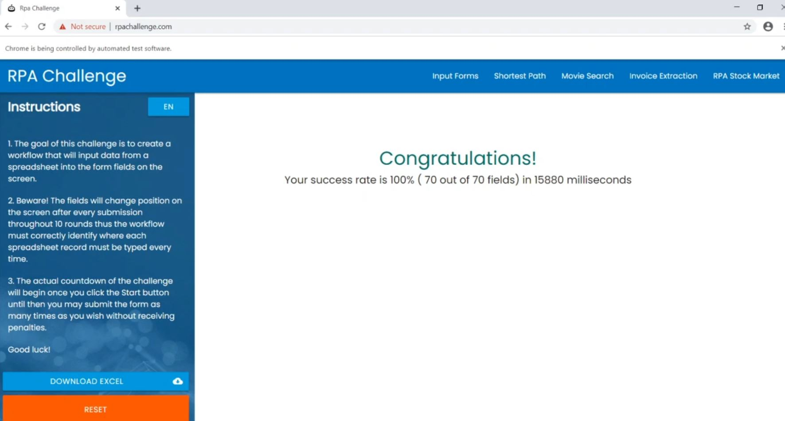

## **RPA Challenge**
1. The goal of this challenge is to create a workflow that will input data from a spreadsheet into the form fields on the screen.
2. Beware! The fields will change position on the screen after every submission throughout 10 rounds thus the workflow must correctly identify where each spreadsheet record must be typed every time.
3. The actual countdown of the challenge will begin once you click the Start button until then you may submit the form as many times as you wish without receiving penalties.

#### Topics -> robotframework, python, rpa-challenge, automation
<h5>Preview Link -> <u><a href="https://drive.google.com/file/d/1gh09T8UOu3S6JHCmrlvg36oqsSvx-XrM/preview">RpaChallenge</a></u></h5>

**What We are going to do?**
<ol>
    <li>Starting the RpaChallenge Website</li>
    <li>Simply input the data from excel sheet</li>
    <li>Finding the suitable selectors and entering the data.</li>
</ol>
### Understanding Some Important Concepts
**What is Robot Framework?**
Robot Framework is a generic open source automation framework. It can be used for test automation and robotic process automation (RPA). Read more on <a href="https://robotframework.org/">robot framework website</a>

We will be using the css selectors.

**But, What are selectors/locators?**

A CSS Selector is a combination of an element selector and a value which identifies the web element within a web page.

<b>The choice of locator depends largely on your Application Under Test</b>

<b>Id</b>
An element’s id in XPATH is defined using: “[@id='example']” and in CSS using: “#” - ID's must be unique within the DOM.
Examples:

```
XPath: //div[@id='example']
CSS: #example
```

<b>Element Type</b>
The previous example showed //div in the xpath. That is the element type, which could be input for a text box or button, img for an image, or "a" for a link. 

```
Xpath: //input or
Css: =input
```

<b>Direct Child</b>
HTML pages are structured like XML, with children nested inside of parents. If you can locate, for example, the first link within a div, you can construct a string to reach it. A direct child in XPATH is defined by the use of a “/“, while on CSS, it’s defined using “>”. 
Examples:

```                        
XPath: //div/a
CSS: div > a
```

<b>Child or Sub-Child</b>
Writing nested divs can get tiring - and result in code that is brittle. Sometimes you expect the code to change, or want to skip layers. If an element could be inside another or one of its children, it’s defined in XPATH using “//” and in CSS just by a whitespace.
Examples:

```
XPath: //div//a
CSS: div a
```

<b>Class</b>
For classes, things are pretty similar in XPATH: “[@class='example']” while in CSS it’s just “.” 
Examples:

```
XPath: //div[@class='example']
CSS: .example
```

**Libraries Required :-**
<ol>
    <li><b>robotframework</b> => It is main framework which runs all the code under the keyword.</li>
    <li><b>robotframework-seleniumlibrary</b> => It is responsible for managing the browser</li>
    <li><b>robotframework-datadriver</b> => It will take the data from excel to the program</li>
</ol>

**So, How to install them ?**
Run the following commands in python shell

```
pip install robotframework
pip install robotframework-seleniumlibrary
pip install robotframework-datadriver
```

#### Step 1 => Starting the RpaChallenge Website (RpaResource.robot)
It will open the browser with the help of selenium webdriver
It will then load the <a href="http://www.rpachallenge.com/">Rpa challenge</a> website and start the test.

```                             
*** Settings ***
Library  SeleniumLibrary

*** Variables ***
${browser}  chrome
${url}      http://www.rpachallenge.com/

*** Keywords ***
StartTheTestCase
Open browser    ${url}  ${browser}
Page Should Contain Element     xpath://button[contains(text(),"Start")]
click element   xpath://button[contains(text(),"Start")]
```

#### Step 2 -> Simply input the data from excel sheet (data_entry.robot)
We will use the robotframework-data driver to load the data from the excel file

```
*** Settings ***
Library  SeleniumLibrary
Library  DataDriver     ../TestData/challenge.xlsx
Resource    ../Resource/RpaResource.robot
Suite Setup     StartTheTestCase
Test Template   EnterTheData

*** Variables ***

*** Test Cases ***
EnterTheData with   ${First}     ${Last}     ${Company}  ${Role}     ${Address}  ${Email}    ${Phone}
```

#### Step 3 -> Finding the suitable selectors and entering the data (data_entry.robot)
We will locate the element with the help to css selector and then enters the required data and finishes the task.

```
*** Settings ***
Library  SeleniumLibrary
Library  DataDriver     ../TestData/challenge.xlsx
Resource    ../Resource/RpaResource.robot
Suite Setup     StartTheTestCase
Test Template   EnterTheData

*** Variables ***

*** Test Cases ***
EnterTheData with   ${First}     ${Last}     ${Company}  ${Role}     ${Address}  ${Email}    ${Phone}

*** Keywords ***
EnterTheData
[Arguments]  ${First}       ${Last}     ${Company}  ${Role}     ${Address}  ${Email}    ${Phone}
input text   xpath://input[@ng-reflect-name="labelPhone"]       ${Phone}
input text   xpath://input[@ng-reflect-name="labelCompanyName"]       ${Company}
input text   xpath://input[@ng-reflect-name="labelRole"]       ${Role}
input text   xpath://input[@ng-reflect-name="labelAddress"]       ${Address}
input text   xpath://input[@ng-reflect-name="labelEmail"]       ${Email}
input text   xpath://input[@ng-reflect-name="labelFirstName"]       ${First}
input text   xpath://input[@ng-reflect-name="labelLastName"]       ${Last}
click element   xpath://input[@type="submit"]
```

#### How to run 
1. Install all the required libraries by : - 
    ```
    pip install -r requirements.txt
    ```

2. Then you need to install the selenium web driver in your system. You can follow this link <a href="https://www.youtube.com/watch?v=dz59GsdvUF8">Youtube</a>

3. Run the following command
    ```
    robot TestCases/data_entry.robot
    ```

#### Web Preview / Output  
